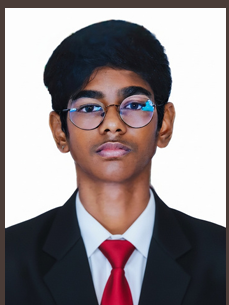
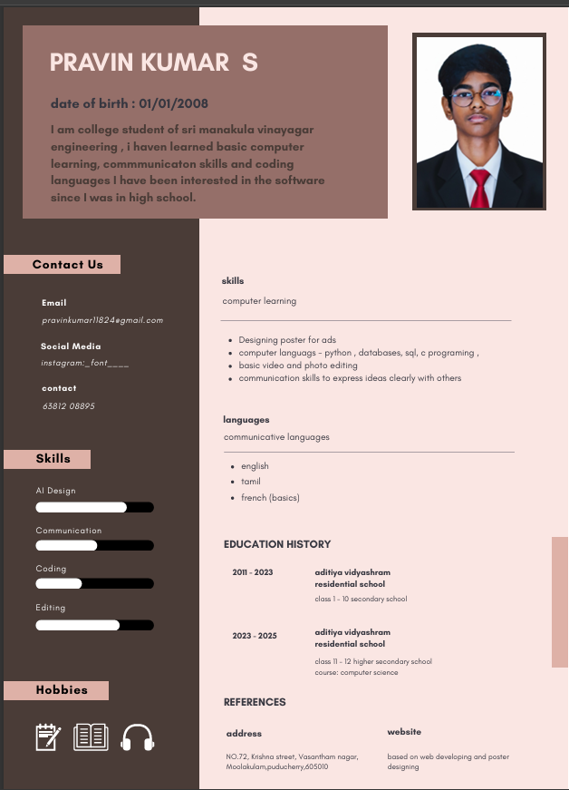

# Portfolio Website Documentation
**Generated for:** Pravin Kumar S
**Date:** February 1, 2026

---

## 1. Hero Section (Home)
**Headline:** Pravin Kumar S
**Sub-headline:** A passionate Computer Science Student & Creative Developer based in Puducherry. I build modern, user-centric web experiences with a touch of innovation.

**Call to Action:**
- View My Work
- Download CV

**Profile Image:**

---

## 2. About Section
**Title:** Who I Am

**Content:**
I am a dedicated student at **Sri Manakula Vinayagar Engineering College**, pursuing Computer Science. My journey involves a blend of technical expertise and creative design thinking.

Passionate about software development since high school, I constantly explore new technologies. Whether it's coding complex algorithms or designing engaging digital assets, I love bringing ideas to life.

Based in **Puducherry**, I am always open to new challenges and collaborative opportunities that allow me to grow and contribute impactful solutions.

**Key Stats:**
- **03+** Years Coding
- **10+** Projects Done
- **05** Tech Stacks
- **100%** Dedication

---

## 3. Skills & Expertise
**Development:**
- HTML5/CSS3
- JavaScript
- Python
- C Programming
- SQL

**Design:**
- UI/UX Layouts
- Poster Design
- Photo Manipulation
- Video Editing

**Tools & Apps:**
- VS Code
- Git
- Figma
- Canva
- Premiere Pro

**Soft Skills:**
- Communication
- Problem Solving
- Teamwork
- Creative Thinking

---

## 4. Featured Projects
### Portfolio Website v1
A personal portfolio website showcasing my skills and journey, built with modern HTML, CSS, and JS.
- *Links:* Code, Live Demo

### Student Management System
A console-based application to manage student records effectively using Python and SQLite.
- *Links:* Code

### Digital Art Collection
A curated collection of digital posters and social media creatives designed using advanced tools.
- *Links:* View Gallery

---

## 5. Education Timeline
**2023 - Present**
**B.Tech in Computer Science**
*Sri Manakula Vinayagar Engineering College*
Specializing in Software Development and Core CS fundamentals. Active member of technical clubs.

**2021 - 2023**
**Higher Secondary (HSC)**
*Aditiya Vidyashram Residential School*
Completed Class 11 & 12 with a focus on Computer Science and Mathematics.

**2011 - 2021**
**Secondary Education**
*Aditiya Vidyashram Residential School*
Strong foundation in technology and academics from Class 1 to 10.

---

## 6. Contact Section
**Get in Touch**

**Contact Details:**
- **Email:** pravinkumar11824@gmail.com
- **Phone:** +91 63812 08895
- **Location:** No.72, Krishna Street, Vasantham Nagar, Moolakulam, Puducherry - 605010
- **Social:** Instagram (@_font____)

---

## 7. Assets
**Resume File:**

